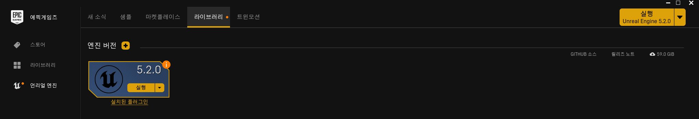
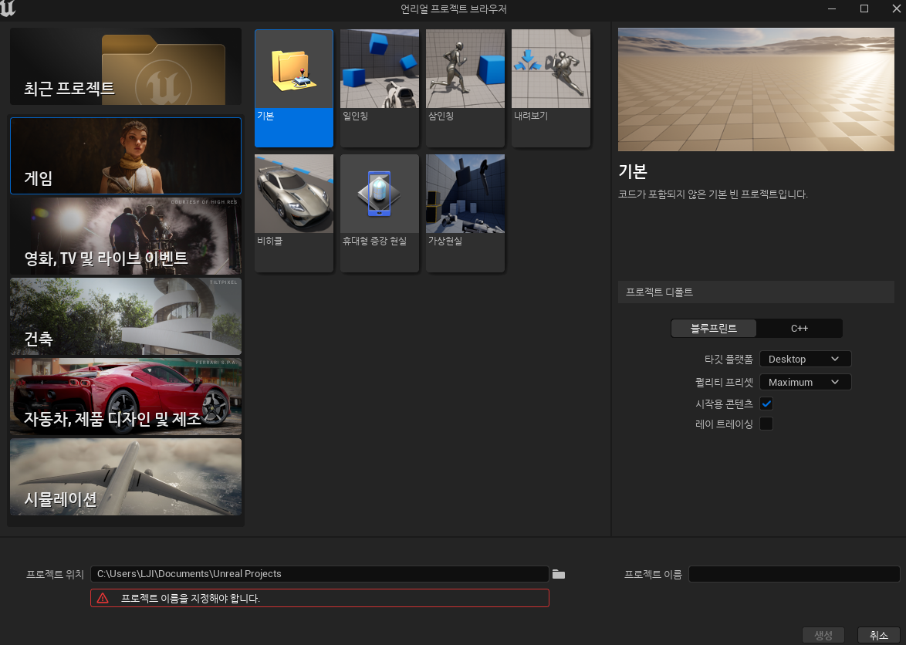
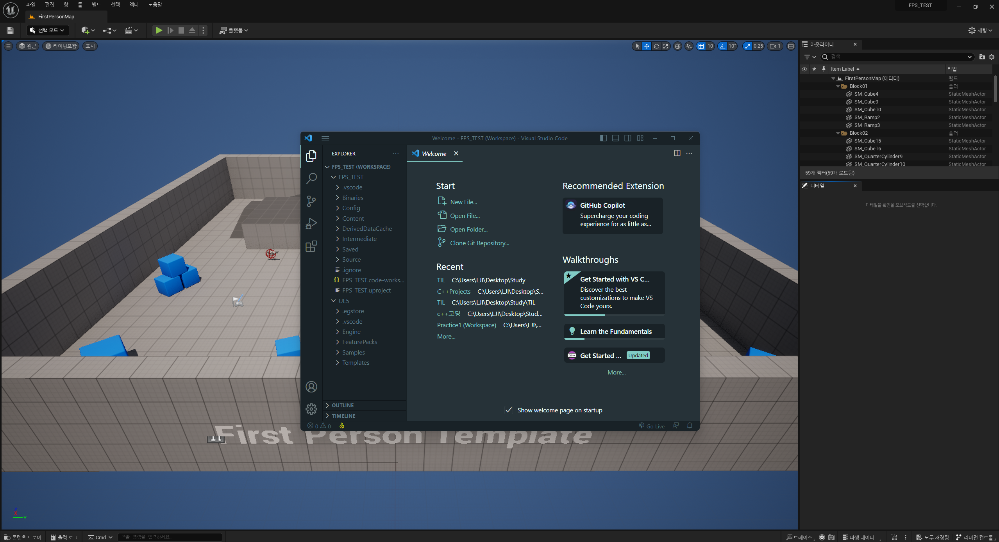
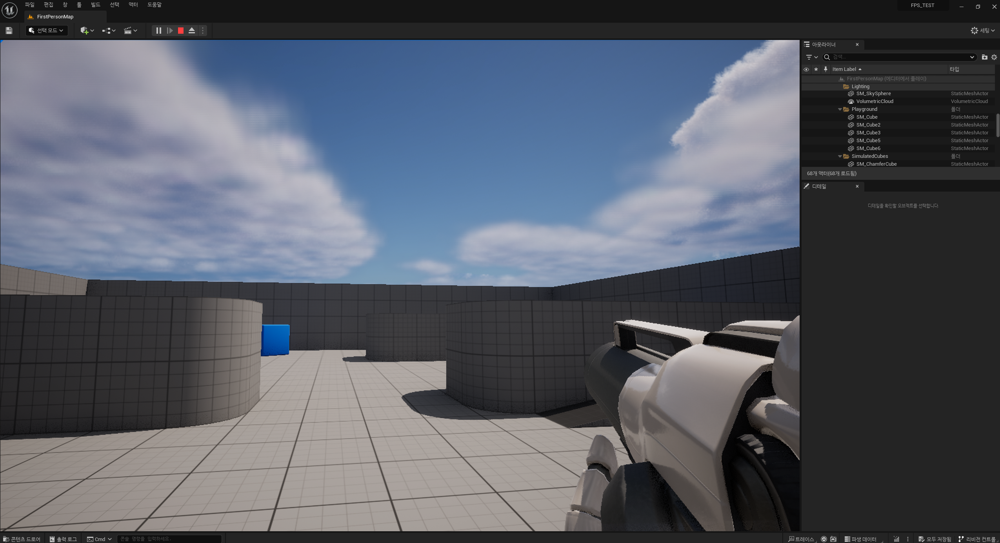

# TIL을 시작하며

Unreal을 제대로 공부하기 시작하려고 하는데 이에 대한 기록과 평소 공부해오던 것에 대한 기록이 필요하다고 생각이 들었다 블로그에도 정리된 내용을 따로 적거나 할지는 아직 미정이지만 일단은 주되고 꾸준한 기록은 이곳 Github에서 해놓는 것이 좋을 것 같다는 생각이 들었다.

---

# TIL

## 1. 알고리즘

오늘 처음 공부한 것은 알고리즘으로 백준에서 2 문제를 풀었었다

[깃허브 링크](https://github.com/II7-Git/dont-stop-the-camera-study/tree/main/LJI)

풀었던 문제는 백준에서 16202*MST게임, 1261*알고 스팟 문제였으며 C++로 풀었다 두 문제에 대한 각각에 코멘트를 달자면

> 1. 16202_MST게임
>    > 먼저 MST게임은 전형적인 MST문제를 게임 형식으로 바꾸어 놓은 문제로 MST를 제시된 K턴만큼 만드는데 이때 사용된 가장 작은 가중치의 간선을 제거하고 매번 다른 비용을 출력해내는 문제였다.
>    > <br/><br/>
>    > Kruskal 알고리즘을 사용해서 Union-Find를 연습하면서 풀었고 주어지는 간선 순으로 가중치가 주어지기에 따로 정렬할 필요가 없었고 그에 따라 턴에 따라 간선 탐색 위치를 다르게 하면 굳이 간선 제거할 필요 없이 턴마다 간선들을 다르게 탐색할 수 있다는게 특징이었다.

```C++
//턴을 기준으로 간선의 시작 위치를 바꾸는 부분
 for (int i = k; i <=M ; i++)//간선의 개수만큼
        {
            if(unions(arr[i].first,arr[i].second,parents)){
                answer += i;
                cnt--;
            }

            if(cnt==1){//이미 모든 노드가 하나가 됨
                break;
            }
        }
```

> 2. 1261\_알고 스팟
>    > 다익스트라를 활용한 문제로서 중요한 부분은 값이 갱신될 때만 다음 큐에 넣음으로써 굳이 추가적인 정보 없이 중복되지 않는 맵 탐색을 시도했다는 점이었다.

```C++
//다익스트라에 중요한 탐색 부분
//특징은 값이 갱신 될 때만 다시 que에 삽입하므로 중복체크 필요가 없다
while (!que.empty())
    {
        pair<int,int> cur = que.front();
        int r = cur.first;
        int c = cur.second;
        que.pop();

        if(r==N-1&&c==M-1){//끝자리 도착하면 더 할 필요는 없을 것
            continue;
        }


        //현재 위치에서 4방 탐색 하여 거리 줄을 시에 갱신 후 que에 넣기
        for (int d = 0; d < 4; d++)
        {
            int nr = r + dr[d];
            int nc = c + dc[d];

            if(!check(nr,nc))continue;

            //만약 기존 최소 거리> 현재 최소 거리+ 다음 위치 값 -> 갱신
            if(dijk[nr][nc]>dijk[r][c]+map[nr][nc]){
                dijk[nr][nc] = dijk[r][c] + map[nr][nc];
                que.push(make_pair(nr, nc));
            }
        }

    }
```

## 2. Unreal Engine

오늘은 첫 언리얼 엔진 공부를 시작하기에 앞서 이유를 말하자면 내가 지향하는 콘솔 게임들이나 고사양 게임들은 주로 언리얼 엔진으로 개발되었기에 많이 해보았던 유니티 엔진이었지만 이를 바탕으로 새롭게 언리얼을 공부하는게 좋을 것 같다고 생각되어서 이렇게 시작하게 되었다.

<br>
언리얼 엔진을 주로 공부할 때 참고한 글은 UnrealEngine 공식 DOCS로 공부하는게 가장 좋을 것 같아서 이를 바탕으로 공부했다.

[언리얼 엔진5.2 공식 문서](https://docs.unrealengine.com/5.2/ko/unreal-engine-programming-and-scripting/)

---

### 시작 준비

언리얼 엔진을 처음 시작하기 위해서 당연히 언리얼 엔진을 설치해야했다.
<br/>
Epic Game Launcher를 통해서 공식 설치가 가능했고 버젼은 공부하기에 그래도 최신 메타를 따라가야겠다고 생각했기에 최소 5 이상을 공부해야겠다고 생각했고 그래서 최종적으로 5.2.0버젼을 사용하기로 했다.



이렇게 설치를 하였고 다음은 실제 구동 테스트를 해보았다.



기본 일인칭 프로젝트를 C++로 기반하여 생성시켜보았다.



처음 에디터로 VSCODE를 지정해놓았기 때문에 처음 실행하자마자 VSCode가 자동으로 실행되는 것을 확인할 수 있었다.
<br>

> [VS Code 설정 참고 링크](https://docs.unrealengine.com/5.2/ko/setting-up-visual-studio-code-for-unreal-engine/)


(실제 구동시켜본 화면)

이를 통해 정상적으로 설치된 것은 확인할 수 있었다.

---

## 끝 마치며

오늘은 처음 시작하며 이것 저것 세팅하고 설치하느라 시간을 많이 빼앗긴 감도 있었다.
다음에는 Unity에서 사용되는 기초 용어들과 개념들을 공부해 볼 생각이다.
이것으로 마치겠다.
