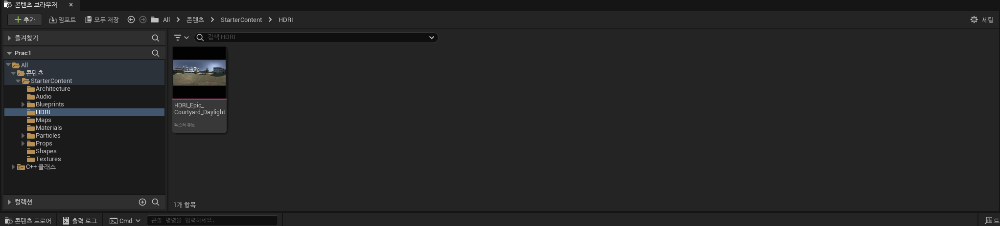
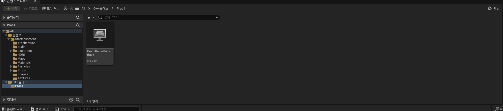
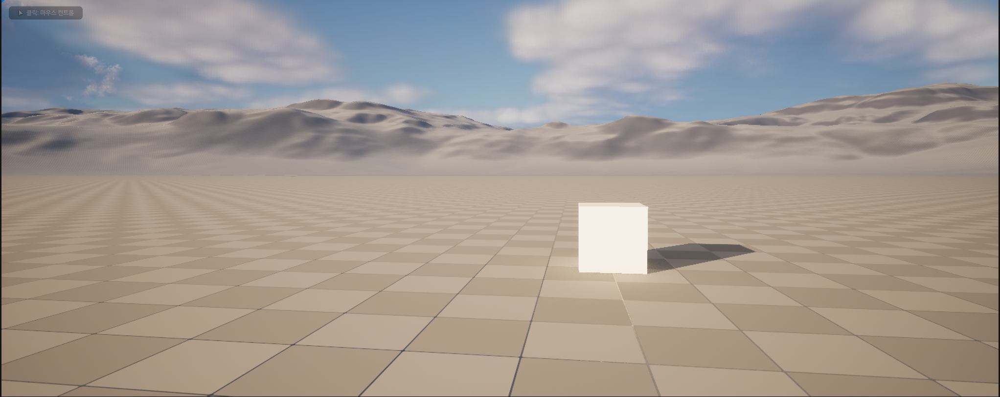
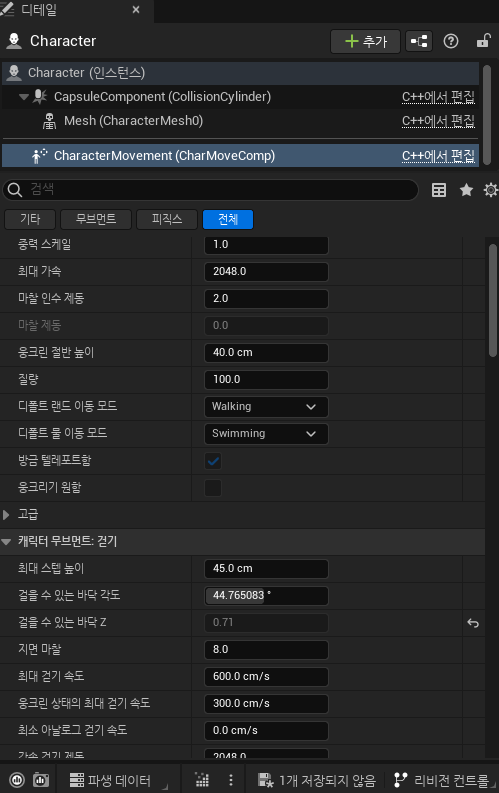

# 23/07/03 TIL

## 알고리즘

오늘은 스터디가 있는 날이라 스터디 준비 알고리즘 문제 하나를 풀고 스터디에 들어갔다.
 스터디에서는 알고리즘 풀었던 문제들을 복습했는데 그리디 방식으로 접근해야하는 호반우 문제 같은 경우 그 방식을 잘 이해하고 설명을 해주어야 한다고 생각해서 스스로 어떤 방식으로 문제를 접근했는지 다시 복습하고 그 방식을 설명하였다.
 또 다른 문제로 백양로 브레이크의 경우는 여러 위치의 최소 신장을 구해야한다는 점을 들어 플로이드 워셜 방식을 택한 이유를 설명하고 가중치를 단방향의 막힌 통로의 1을 둔 이유를 스터디원들에게 잘 설명하면서 스스로 그렇게 코딩한 이유도 다시 한번 상기시켰다.
 그리고 마지막으로 박스 포장 문제는 어떻게 접근해야할지 모르겠어서 냅뒀던 문제였는데 맡은 스터디원의 설명을 듣고 어떤 방식으로 구현을 접근해야할지 이해했고 다시 풀어볼 예정이다.

## 언리얼 엔진

오늘은 전에 익혔던 용어들을 실제 툴에서 찾아보고 툴 자체의 여러 기능들을 눌러보며 실제 언리얼 엔진에 적응하기로 하였다.
  그래서 먼저 빈 프로젝트를 하나 만든 뒤 기본적인 메뉴의 다양한 기능들을 실제 사용해보았다. 이 과정에서 공식 문서에서 다음 내용을 참고했다.
 
[참고 링크 : 인터페이스](https://docs.unrealengine.com/5.2/ko/unreal-editor-interface/)

위 링크를 바탕으로 처음 유니티를 배웠을 때 처럼 기본 셰이프 생성해보고 위치를 조작해보고 스크립트를 어떻게 작성하고 적용시킬지 등을 사용해보았다.

유니티처럼 스크립트와 오브젝트를 분리해놓은 기본 구조를 확인할 수 있었다.

실제로 간단한 오브젝트와 캐릭터를 생성한 후 구동해보았다. 기본적인 캐릭터 액터를 생성하니 자동을 wasd 마우스 동작 방식이 지원되는 점이 인상깊고 좋다고 생각했다.

가장 인상깊었던 부분이다. 캐릭터를 생성하고 보니 여러 창이 있어서 스크립트를 볼 겸해서 클릭하며 인스펙터 창을 보았는데 위 사진처럼 캐릭터에 동작에 관한 많은 부분을 기본적으로 구현되어있었다. 유니티에서도 기본적인 오브젝트의 중력 마찰계수 등을 설정할 수 있었지만 캐릭터 움직임에 관한 처리는 따로 스크립트를 했어야했다면 언리얼은 다음처럼 캐릭터의 기초적인 동작에서 설정할 부분들이 스크립트로 구성되어있고 인스펙터 창으로도 지원되는것이 좋다 느꼈다.

## 다음엔...

다음엔 보다 본격적으로 배우면서 유니티에서 다뤘던 것 처럼 스크립트를 자유롭게 작성하고 적용하게 좀 더 숙련도를 올려야겠다고 생각했다.
