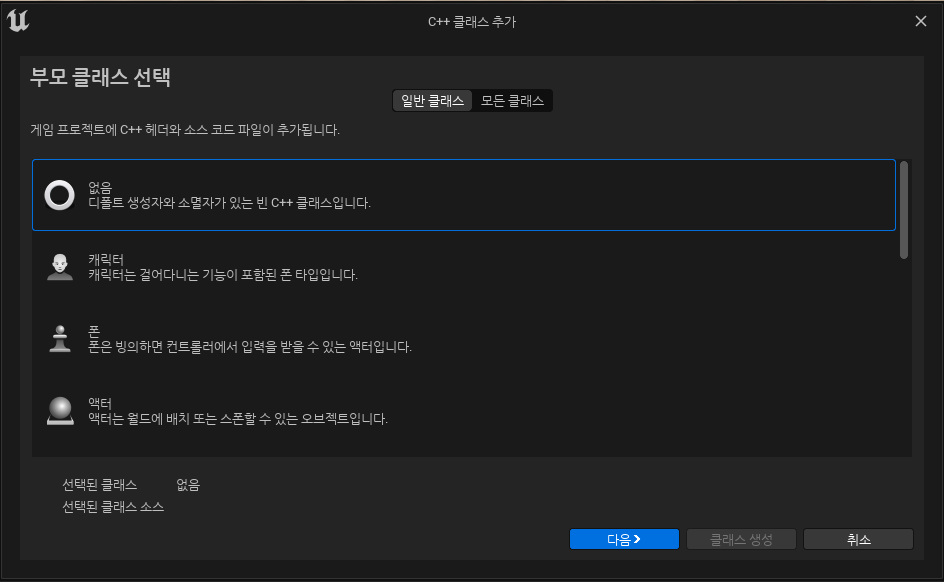
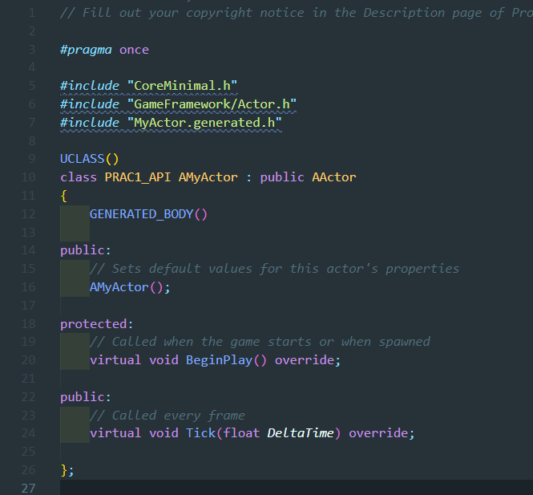

# TIL

## 언리얼 엔진

오늘은 실제 언리얼엔진에서 코드를 사용하고 적용하는 방법을 배우기 위해 공부를 하기로 하였다.<br>
먼저 코딩에 들어가기에 앞서 기초적인 규칙이 담긴 문서가 있어서 참고하였다.<br/>

[참고 자료 : 코딩 표준](https://docs.unrealengine.com/5.2/ko/epic-cplusplus-coding-standard-for-unreal-engine/)<br>

다음 문서를 보면 다양한 표준 코딩 작성법에 대한 도움을 얻을 수 있었다. 특히 <u>명명 규칙</u>은 매우 중요하다는 생각이 들었다.

[참고 자료 : 블루프린트와 C++](https://docs.unrealengine.com/4.26/ko/Resources/SampleGames/ARPG/BalancingBlueprintAndCPP/)<br>

또 개인적으로 궁금했던 것이 블루프린트 방식과 C++ 방식의 차이였는데 위 문서를 확인하면 그 이유를 알 수 있었다.<br/>
블루프린트 방식은 좀 더 빠른 생성과 반복 처리 등이 가능하고 사용하는데 있어서 쉽다는 장점이 있다.<br>
반면 C++방식은 코드 기반이어서 런타임 퍼포먼스가 더 좋게 나오고 같은 개발자들 사이에서는 오히려 더 직관적이게 파악할 수 있다.<br>
또한 그 외에도 여러 장점이 있다는 것을 알 수 있었다. 단점으로는 난이도를 뺀다면 표준에 대한 검사가 엄격해서 잘 지켜야한다 정도 있는 것 같았다.

그래서 결론은 물론 블루프린트 방식이 처음에 익히기는 쉽겠지만 게임업계를 지향함에 있어서는 당연히 C++가 맞다는 확신을 얻을 수 있었다. 단, 위 문서에서 언급됐듯이 작업을 하기 전에 프로토타입으로 가볍게 돌릴 때 블루프린트를 사용해도 좋을 것 같다는 생각은 들었다.

### 코드 학습


처음 C++를 생성할 때 다음과 같이 부모클래스를 상속받을 수 있게 창이 뜬다.
이를 바탕으로 어떠한 기능을 베이스로 삼을건지 편하게 선택이 가능했다.


위 모습은 기본 클래스 생성 시 확인할 수 있는 header 파일에 포함된 내용인데 크게 변수를 초기화 할 생성자와 BeginPlay(), Tick() 함수가 있는 것을 확인할 수 있다.

BeginPlay()는 액터가 처음 생성(게임 시작 or 액터 월드 스폰)됐을 때 처음 실행되는 초기화 함수이다.

Tick(float DeltaTime)은 매 프레임마다 한번씩 호출되는 함수이다. DeltaTime을 통해 그 전 실행부터 얼마나 차이가 났는지는 알 수 있다.
단 Tick()은 반드시 필요한 함수는 아니다.<br>
Tick 함수 제거를 위해서는 헤더 및 소스 파일에서 이 부분 제거 후, 소스파일 생성자에서 PrimaryActorTick.bCanEverTick=true 코드를 제거해야 한다.

### 로그 남기기

```
UE_LOG(LogTemp, Log, TEXT(""));
```
