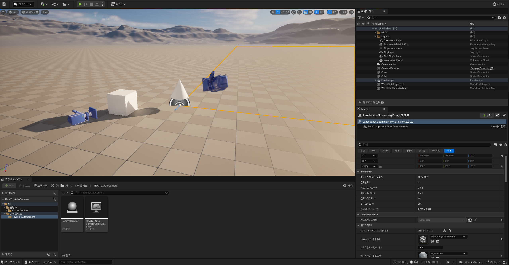

# 23/07/11 TIL

## 알고리즘

오늘은 알고리즘 스터디를 진행하면서 꽤나 도움을 얻을 수 있었다. 
저번 주 문제였던 [비즈네르 암호 해독](https://www.acmicpc.net/problem/26266) 문제를 결국 시간 초과는 해결하지 못하고 스터디를 시작하게 됐었다.  내 기존 풀이에서는 암호에 첫 단어는 무조건 고정이니 같은 단어가 아니면 굳이 탐색하지 않는 백트래킹만 했었는데 이래도 시간 초과가 나서 어딘가 놓치고 있다는 생각은 했지만 그 곳이 어딘지를 몰라서 결국 풀지 못했던 문제였는데 오늘 스터디에서 다른 분의 풀이를 보고 어딜 놓쳤는지 알 수 있었다.
  내가 놓쳤던 부분은 암호가 온전히 반복되는 문자열만 주어진다는 점이어서 암호가 평문의 길이의 약수여야만 한다는 점이었다.
이 점을 유의하며 백트래킹 요소만 추가해주니 바로 문제를 풀어낼 수 있었다.

이 문제에 놓쳤던 부분을 보면서 들었던 생각은 문제를 좀 더 신중하게 읽지 못해서 암호문이 온전히 반복되는 길이가 주어진다는 점을 놓쳤던 게 일차적인 부분이고 또 시간 초과를 확인하고 분명 어딘가 백트래킹이 부족할 것 같다는 생각을 하고 알고리즘의 동작 원리를 생각해보지 못했다는 점이었다.

앞으로는 이러한 점들을 조금은 더 주의깊게 확인하면 좀 더 좋은 알고리즘을 구성할 수 있을 것 같다.

## Unreal Engine

오늘은 알고리즘에 집중해서 길게 하진 않고 저번 주에 정리했던 내용들을 다시 한번 읽어보고 실제 튜토리얼 예제에서 카메라 배치를 동작시켜보았다

[튜토리얼 링크](https://docs.unrealengine.com/5.2/ko/unreal-engine-cpp-programming-tutorials/)

실제 실습 화면으로 두 카메라를 즉시 혹은 부드럽게 이동하는 모습을 확인할 수 있었다.
